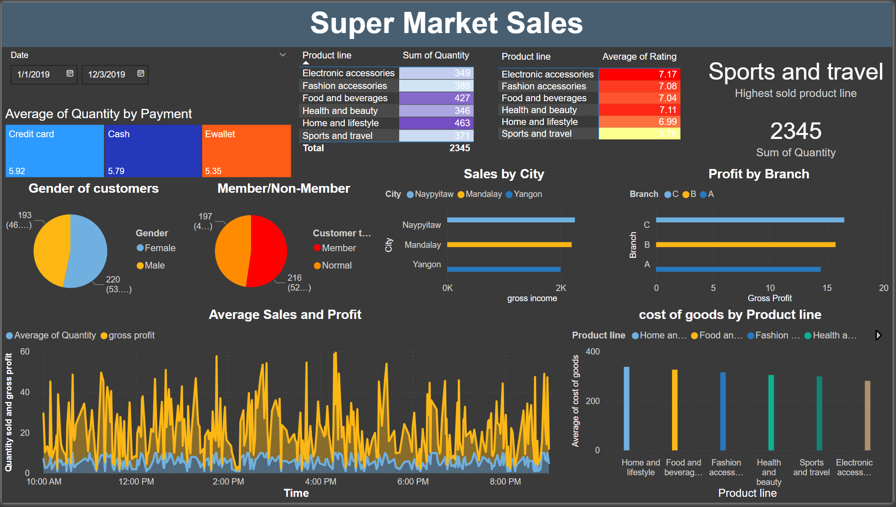

# 🛒 Supermarket Sales Analysis Dashboard

[](https://opensource.org/licenses/MIT)
[](https://powerbi.microsoft.com/)
[](data/supermarket_sales.csv)
[]()
[]()
[]()

A comprehensive Power BI dashboard that provides deep insights into supermarket sales data across multiple branches. This interactive visualization tool helps analyze sales patterns, customer behavior, product performance, and profitability metrics.



> **⚠️ Business Note**: This dashboard is designed for business intelligence and decision-making. For optimal insights:
> - Review daily/weekly trends
> - Monitor product line performance
> - Track customer demographics
> - Analyze payment preferences
> - Evaluate branch performance

## 📋 Table of Contents
- [Overview](#overview)
- [Key Features](#key-features)
- [Dashboard Components](#dashboard-components)
- [Dataset Description](#dataset-description)
- [Technical Implementation](#technical-implementation)
- [Installation](#installation)
- [File Structure](#file-structure)
- [Usage](#usage)
- [Key Insights](#key-insights)
- [Future Improvements](#future-improvements)
- [Acknowledgments](#acknowledgments)
- [License](#license)

## 🎯 Overview

The Supermarket Sales Analysis Dashboard transforms complex sales data into actionable insights through detailed visualization and analysis of various business metrics. Through comprehensive visualization of sales patterns, customer segmentation, and product performance, it enables data-driven decision-making.

## ✨ Key Features

- 📅 Interactive Date Slicer
- 📊 Product Performance Analysis
- 👥 Customer Demographics
- 💳 Payment Method Tracking
- 📍 Geographic Analysis
- 💰 Profit Metrics
- ⭐ Rating Analysis

## 📊 Dashboard Components

### 1. Sales Performance
- Product line-wise quantity sold
- Average ratings by product category
- Total quantity tracking
- Highest sold product line identification

### 2. Customer Analysis
- Gender distribution visualization
- Member vs Non-member ratio
- Payment method preferences
  - Credit card
  - Cash
  - E-wallet

### 3. Geographic Performance
- Sales by city (Yangon, Mandalay, Naypyitaw)
- Profit analysis by branch (A, B, C)
- City-wise profitability metrics

### 4. Time Series Analysis
- Average sales and profit trends
- Time-of-day analysis
- Daily performance tracking

## 📚 Dataset Description

The dataset includes comprehensive transaction records with the following metrics:

### 📋 Key Metrics
- 💰 Sales and Revenue
- 📝 Product Categories
- 👤 Customer Information
- 💳 Payment Types
- 📍 Location Data
- ⭐ Customer Ratings
- 📅 Temporal Data

### Product Categories
- Electronic accessories
- Fashion accessories
- Food and beverages
- Health and beauty
- Home and lifestyle
- Sports and travel

## 🔧 Technical Implementation

### Interactive Features
- Date range selector
- Product line filters
- City and branch filters
- Real-time metric updates

### Visualization Types
1. Matrix displays
2. Bar charts
3. Pie charts
4. Area charts
5. Cards
6. Heat maps

## 📥 Installation

```bash
# Download Power BI Desktop
# Clone this repository
git clone https://github.com/pouryare/supermarket-sales-dashboard.git
cd supermarket-sales-dashboard

# Open the .pbix file
# Connect to your data source
# Refresh the dashboard
```

## 📁 File Structure

```
📦 supermarket-sales-dashboard
 ┣ 📂 data/
 ┃ ┗ 📜 supermarket_sales.csv
 ┣ 📷 screenshot.png
 ┣ 📜 supermarket_sales.pbix
 ┣ 📜 LICENSE
 ┗ 📜 README.md
```

## 🚀 Usage

1. Open the .pbix file in Power BI Desktop
2. Use the date slicer to select time period
3. Filter by product categories
4. Analyze geographic performance
5. Monitor customer segments
6. Track payment preferences

## 🔍 Key Insights

1. **Customer Demographics**
   - 53% female customers
   - 50/50 member split
   - Varied payment preferences

2. **Product Performance**
   - Home and lifestyle leads sales
   - Strong electronic accessories performance
   - Distinct rating patterns

3. **Geographic Trends**
   - Balanced city distribution
   - Unique branch profit patterns
   - Location-specific preferences

## 📈 Future Improvements

1. Add seasonal analysis
2. Implement predictive analytics
3. Include inventory metrics
4. Add customer loyalty tracking
5. Enhance geographic visualization

## 🙏 Acknowledgments

- Power BI Community
- Sales Data Contributors

## 📄 License

This project is licensed under the MIT License - see the [LICENSE](LICENSE) file for details.

Made with ❤️ by [Pourya](https://github.com/pouryare)

[](https://github.com/pouryare)